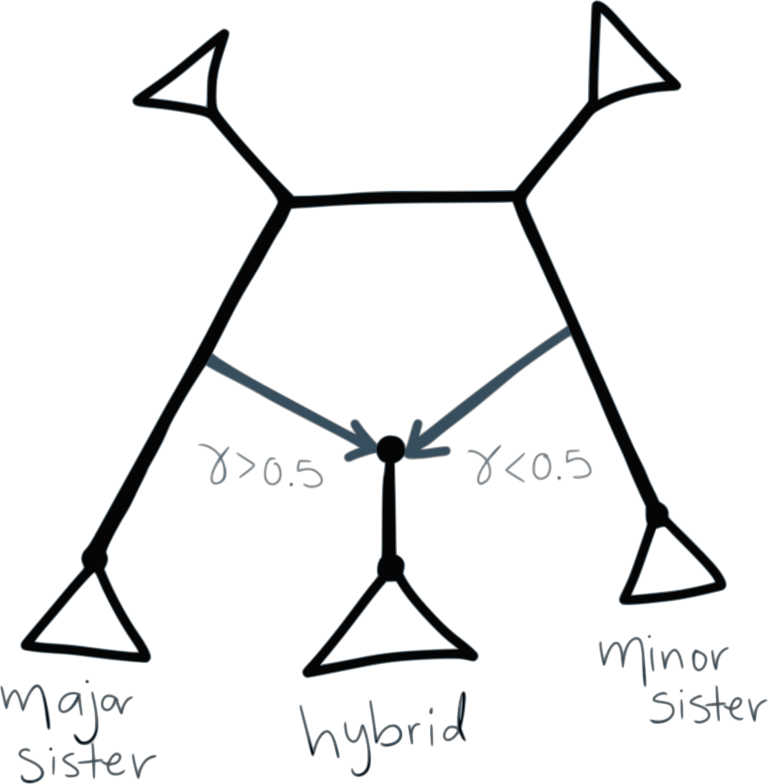

## 6. Running SNaQ

To run SNaQ, you need
- data extracted from sequence alignments:
  - a list of estimated **unrooted** gene trees, or
  - a table of concordance factors (CF) (e.g. from BUCKy)
- a starting topology (e.g. from Quartet MaxCut or ASTRAL, or RAxML tree from a single gene...)

Loading the Julia packages in Julia:
```julia
using PhyloNetworks
using PhyloPlots
```

### 6.1 Read the CF table into Julia:
```julia
buckyCF = readTableCF("bucky-output/1_seqgen.CFs.csv")
```

For the commands to read estimated gene trees, see [here]().

### 6.2 Read the starting population tree into Julia:
```julia
tre = readTopology("bucky-output/1_seqgen.QMC.tre")
```

### 6.3 Estimate the best network for a number of hybridizations
Estimate the best network from bucky's quartet CF and `hmax` number of hybridizations (make sure to have a folder called `snaq` in the working directory):
```julia
net0 = snaq!(tre,  buckyCF, hmax=0, filename="snaq/net0_bucky", seed=123)
net1 = snaq!(net0, buckyCF, hmax=1, filename="snaq/net1_bucky", seed=456)
```

To use multiple threads while running snaq, see [here]().

NOTE: Increase the number of hybridizations sequentially:
`hmax=0,1,2,...`, and use the best network at `h-1` as starting
point to estimate the best network at `h`.

### 6.4 Plot the estimated network

NOTE: Recall that the produced network is semi-directed, not rooted.
```julia
rootatnode!(net1, "6")
```

NOTE: If you cannot root at your outgroup, make sure to check the `.networks` file for alternative networks that could have a similar pseudolik score.

```
xxx
```

Plotting the estimated networks:
```julia
using PhyloPlots
plot(net1, :R);
```
again, if a plot window didn't pop up, an alternative is to save the plot
as a pdf and open it outside of julia:

```julia
R"pdf"("plot-net1.pdf", width=3, height=3);
plot(net1, :R);
R"dev.off()";
```

NOTE: Ghost lineages are a thing!

## 7. Bootstrapping

You need as input:

- data from sequence alignment that capture uncertainty:
  - credibility intervals for quartet concordance factors, from TICR
  - bootstrap gene trees from RAxML (same format that ASTRAL uses)
- a starting topology

### 7.1 Reading in data

We will focus on the case of CF credibility intervals:

```julia
using CSV, DataFrames
buckyDat = CSV.read("bucky-output/1_seqgen.CFs.csv") # names like: CF12.34, CF12.34_lo etc.
rename!(buckyDat, Symbol("CF12.34") => :CF12_34)     # bootsnaq requires these colunm names
rename!(x -> Symbol(replace(String(x), "." => "_")), buckyDat) # do all in one go
```

### 7.2 Running bootstrap
```julia
bootnet = bootsnaq(net0, buckyDat, hmax=1, nrep=50, runs=3,
                   filename="snaq/bootsnaq1_buckyCI")
```

These settings are to make calculations faster. For a real data set,
up the number of bootstrap replicates to 100 or more, by changing `nrep`.
Also increase the number of independent search runs per replicate, `runs`
or just remove the `runs` option to get the default 10 runs.


### 7.3 Bootstrap summary

NOTE: If you close your session after having generated these bootstrap networks, you can
read them from the output file later, in a new session.
This output file ends in `.out`, so you would do this:
```julia
bootnet = readMultiTopology("snaq/bootsnaq1_buckyCI.out");
```

To make summaries, it's best to re-read the reference network (best,
estimated network) from file, to get a consistent numbering of nodes and edges.
Here, we re-read from file, re-root the network correctly.

```julia
net1 = readTopology("snaq/net1_bucky.out")
rootatnode!(net1, "6")
```

#### 7.3.1 Bootstrap summary of tree edges

Same as with species tree, we simply count the number of times each edge in the major tree from the estimated network appears in the bootstrap major trees.

```julia
BSe_tree, tree1 = treeEdgesBootstrap(bootnet,net1)
show(BSe_tree, allrows=true)
BSe_tree[BSe_tree[:proportion] .< 1.0, :]
```
where `tree1` is the major tree in `net1` (the best network estimated with the original data)
and `BSe_tree` is a data frame with the bootstrap support that each tree edge is found
in the major tree.

[add output here to interpret]

We can plot this information on the estimated network.
The command will only label the edges with
bootstrap support less than 100%.

```julia
plot(net1,  :R, edgeLabel=BSe_tree[BSe_tree[:proportion] .< 100.0, :]);
```

#### 7.3.2 Bootstrap summary of hybridization events

We focus on three types of clades:
- hybrid clade: hardwired cluster (descendants) of either hybrid edge
- major sister clade: hardwired cluster of the sibling edge of the major hybrid edge
- minor sister clade: hardwired cluster of the sibling edge of the minor hybrid edge

<br>

```julia
BSn, BSe, BSc, BSgam, BSedgenum = hybridBootstrapSupport(bootnet, net1);
```
- `BSn` is a table of bootstrap frequencies associated with **n**odes
- `BSe` is a table of bootstrap frequencies associated with **e**dges, and
- `BSc` describes the makeup of all **c**lades.

[wait to run actual analysis to interpret]