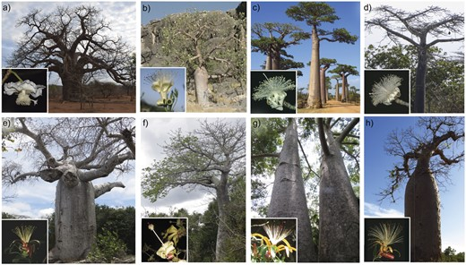

# Data: Baobabs

We will be using the public data of [Karimi et al, 2020](https://academic.oup.com/sysbio/article/69/3/462/5613901) that consists of 371 aligned loci and 8 species of _Adansonia_ plus an outgroup.

_Image from Karimi et al (2020)_

The original data is in FASTA format (see [here](https://github.com/solislemuslab/snaq-tutorial/tree/main/data/fasta-alignments)), but we need NEXUS format to run MrBayes.

We have a julia script to convert FASTA to NEXUS in the repository ([convertFasta2Nexus.jl](https://github.com/solislemuslab/snaq-tutorial/blob/main/scripts/convertFasta2Nexus.jl)), but for the sake of time, the NEXUS files are already converted in the repository (see [here](https://github.com/solislemuslab/snaq-tutorial/tree/main/data/nexus-alignments)).

