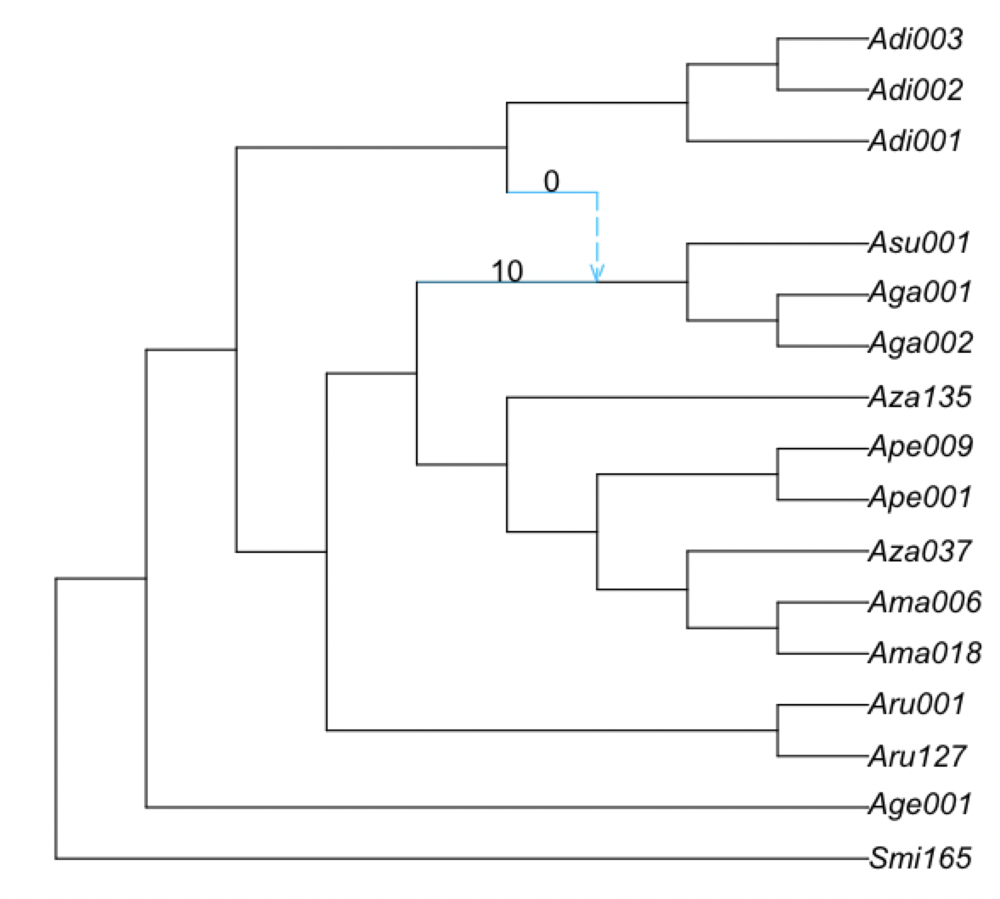
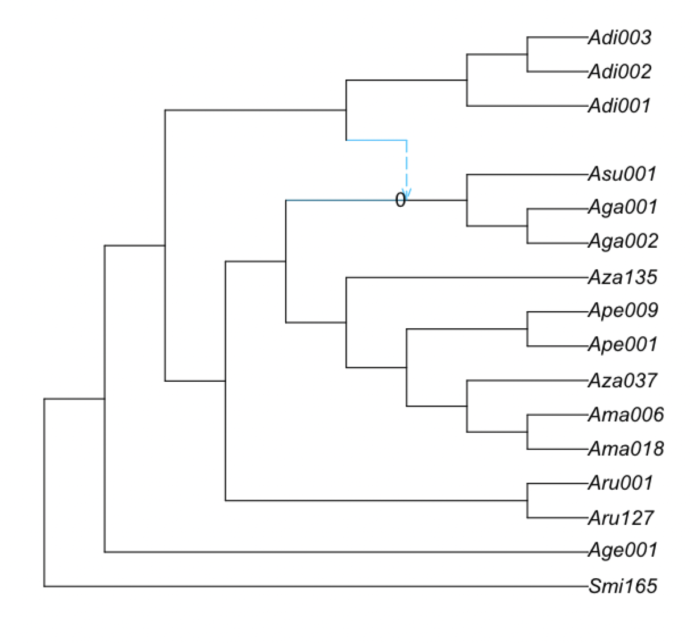
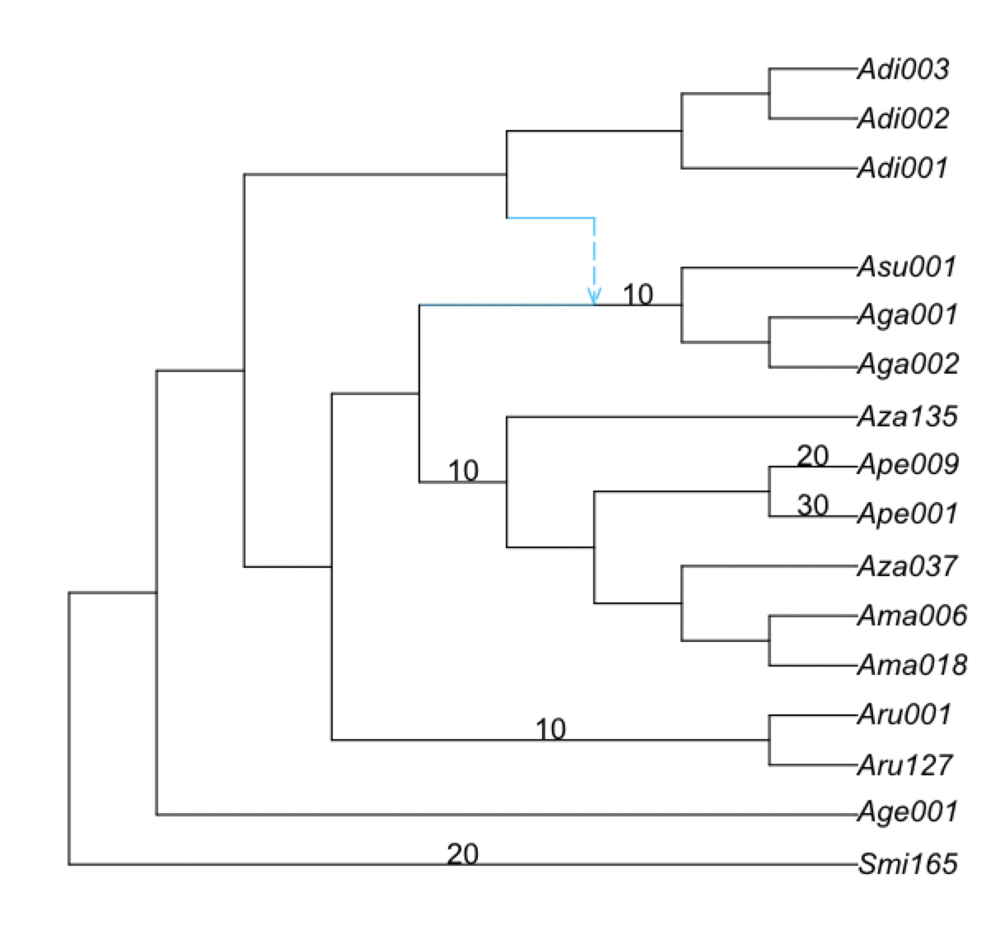

# Estimating phylogenetic networks with SNaQ

To run SNaQ, you need
- data extracted from sequence alignments:
  - a list of estimated **unrooted** gene trees, or
  - a table of concordance factors (CF) (e.g. from BUCKy)
- a starting topology (e.g. from Quartet MaxCut or ASTRAL, or RAxML tree from a single gene...)

In the `analysis` folder, we have:
- starting topology in `nexus.QMC.tre`
- table of concordance factors in `nexus.CFs.csv`

We move into the `analysis` folder and start a `julia` session:

```
cd analysis
julia
```

Note that we do not need to run this inside the Docker container anymore. We can run this locally as long as Julia is installed.

Loading the Julia packages in Julia:
```julia
using PhyloNetworks
using PhyloPlots
```

### 1. Read the CF table into Julia:
```julia
buckyCF = readTableCF("nexus.CFs.csv")
```

For the commands to read estimated gene trees, see [here](https://crsl4.github.io/PhyloNetworks.jl/latest/man/inputdata/#Tutorial-data:-gene-trees).

### 2. Read the starting population tree into Julia:
```julia
tre = readTopology("nexus.QMC.tre")
```

### 3. Estimate the best network for a number of hybridizations
Estimate the best network from bucky's quartet CF and `hmax` number of hybridizations (make sure to have a folder called `snaq` in the working directory):
```julia
net1 = snaq!(tre, buckyCF, hmax=1, runs=1, filename="net1_snaq", seed=456, ftolRel=1.0e-4, ftolAbs=1.0e-4,liktolAbs = 1.0e-4)
```

We get the following output:
```
optimization of topology, BL and inheritance probabilities using:
 hmax = 1,
 tolerance parameters: ftolRel=0.0001, ftolAbs=0.0001,
                       xtolAbs=0.001, xtolRel=0.01.
 max number of failed proposals = 75, liktolAbs = 0.0001.
rootname for files: net1_snaq
BEGIN: 1 runs on starting tree (Adi003,Adi002,(Adi001,((Smi165,Age001):0.07589939081007356,((Aru001,Aru127):1.9682746896593077,(((((Ama018,Ama006):0.6629549814235081,Aza037):0.21433997268234162,(Ape001,Ape009):0.7884933825184368):0.18446207186910396,Aza135):1.3930094839022371,((Aga002,Aga001):1.2489054987527415,Asu001):1.4066659751431154):0.10433470784878054):0.4862466639316025):2.576481877732949):0.15900373131300743);
2023-10-30 11:6:32.177
seed: 456 for run 1, 2023-10-30 11:6:32.178
best network and networks with different hybrid/gene flow directions printed to .networks file

MaxNet is (Adi002,Adi003,(Adi001,(((Age001,Smi165):0.06875186065692804,((Aru127,Aru001):1.8687868412877533,(((((Ama018,Ama006):0.698443686475557,Aza037):0.19780781753126722,(Ape001,Ape009):0.7906658263817897):0.15824335685281474,Aza135):1.2746785120008084,(((Aga002,Aga001):0.9578274060631259,Asu001):0.05377232098269331)#H21:1.6350802194135956::0.9574040911680053):0.12112736705285018):0.5109945051523238):2.58254022447432,#H21:9.99524670493258::0.04259590883199469):0.08449362588888307):0.14641124238464875); 
with -loglik 961.1069527325545
HybridNetwork, Un-rooted Network
32 edges
32 nodes: 16 tips, 1 hybrid nodes, 15 internal tree nodes.
tip labels: Adi003, Adi002, Adi001, Smi165, ...
(Adi002,Adi003,(Adi001,(((Age001,Smi165):0.069,((Aru127,Aru001):1.869,(((((Ama018,Ama006):0.698,Aza037):0.198,(Ape001,Ape009):0.791):0.158,Aza135):1.275,(((Aga002,Aga001):0.958,Asu001):0.054)#H21:1.635::0.957):0.121):0.511):2.583,#H21:9.995::0.043):0.084):0.146);
```

We are just doing 1 run (`runs=1`) and we are increasing the optimization tolerance (`ftolRel=1.0e-4, ftolAbs=1.0e-4,liktolAbs = 1.0e-4`) for the sake of computational time, but you should do at least 10 runs in your data and keep the default tolerance parameters.

To use multiple threads while running snaq, see [here](https://crsl4.github.io/PhyloNetworks.jl/latest/man/snaq_plot/#parallel-computations).

**Important:** You should increase the number of hybridizations sequentially:
`hmax=0,1,2,...`, and use the best network at `h-1` as starting
point to estimate the best network at `h`.

### 4. Overview of the output files

The estimated network is in the `net1_snaq.out` file which also has the running time: 7502.05 seconds (~2 hours) in my computer:

```
% less analysis/net1_snaq.out 

(Adi002,Adi003,(Adi001,(((Age001,Smi165):0.06875186065692804,((Aru127,Aru001):1.8687868412877533,(((((Ama018,Ama006):0.698443686475557,Aza037):0.19780781753126722,(Ape001,Ape009):0.7906658263817897):0.15824335685281474,Aza135):1.2746785120008084,(((Aga002,Aga001):0.9578274060631259,Asu001):0.05377232098269331)#H21:1.6350802194135956::0.9574040911680053):0.12112736705285018):0.5109945051523238):2.58254022447432,#H21:9.99524670493258::0.04259590883199469):0.08449362588888307):0.14641124238464875); -Ploglik = 961.1069527325545
 Dendroscope: (Adi002,Adi003,(Adi001,(((Age001,Smi165):0.06875186065692804,((Aru127,Aru001):1.8687868412877533,(((((Ama018,Ama006):0.698443686475557,Aza037):0.19780781753126722,(Ape001,Ape009):0.7906658263817897):0.15824335685281474,Aza135):1.2746785120008084,(((Aga002,Aga001):0.9578274060631259,Asu001):0.05377232098269331)#H21:1.6350802194135956):0.12112736705285018):0.5109945051523238):2.58254022447432,#H21:9.99524670493258):0.08449362588888307):0.14641124238464875);
 Elapsed time: 7502.05 seconds, 1 attempted runs
-------
List of estimated networks for all runs (sorted by log-pseudolik; the smaller, the better):
 (Adi002,Adi003,(Adi001,(((Age001,Smi165):0.06875186065692804,((Aru127,Aru001):1.8687868412877533,(((((Ama018,Ama006):0.698443686475557,Aza037):0.19780781753126722,(Ape001,Ape009):0.7906658263817897):0.15824335685281474,Aza135):1.2746785120008084,(((Aga002,Aga001):0.9578274060631259,Asu001):0.05377232098269331)#H21:1.6350802194135956::0.9574040911680053):0.12112736705285018):0.5109945051523238):2.58254022447432,#H21:9.99524670493258::0.04259590883199469):0.08449362588888307):0.14641124238464875);, with -loglik 961.1069527325545
-------
```


### 4. Plot the estimated network

Recall that the produced network is semi-directed, not rooted, so we need to root at the outgroup:
```julia
rootatnode!(net1, "Smi165")
```

If you get an error when trying to root at your outgroup, make sure to check the `.networks` file for alternative networks that could have a similar pseudolik score.

<div style="text-align:center"></div>

Now, we will plot the estimated networks:
```julia
plot(net1, :R);
```

<div style="text-align:center"></div>

If a plot window didn't pop up, an alternative is to save the plot
as a pdf and open it outside of julia:

```julia
R"pdf"("plot-net1.pdf", width=3, height=3);
plot(net1, :R);
R"dev.off()";
```

**Important:** SNaQ can infer hybridizations with extinct or unsampled taxa (ghost lineages). Thus, keep this in mind when interpreting the hybridization event, especially if the hybridization event appears to be connecting an ancestral lineage with a more recent one.

<div style="text-align:center"></div>

## Bootstrapping

You need as input:

- data from sequence alignment that capture uncertainty:
  - credibility intervals for quartet concordance factors, from TICR
  - bootstrap gene trees from RAxML (same format that ASTRAL uses)
- a starting topology

### 1. Reading in data

We will focus on the case of CF credibility intervals:

```julia
using CSV, DataFrames
buckyDat = CSV.read("nexus.CFs.csv", DataFrame) # names like: CF12_34, CF12_34_lo etc.
```

### 2. Running bootstrap
```julia
bootnet = bootsnaq(tre, buckyDat, hmax=1, nrep=10, runs=1,
                   filename="bootsnaq1", ftolRel=1.0e-4, ftolAbs=1.0e-4,liktolAbs = 1.0e-4)
```

Again, these settings are to make calculations faster. For a real data set,
up the number of bootstrap replicates to 100 or more, by changing `nrep`.
Also increase the number of independent search runs per replicate, `runs`
or just remove the `runs` option to get the default 10 runs.


### 3. Bootstrap summary

If you close your session after having generated these bootstrap networks, you can
read them from the output file later, in a new session.
This output file ends in `.out`, so you would do this:
```julia
bootnet = readMultiTopology("bootsnaq1.out");
```

To make summaries, it's best to re-read the reference network (best,
estimated network) from file, to get a consistent numbering of nodes and edges.
Here, we re-read from file, re-root the network correctly.

```julia
net1 = readTopology("net1_snaq.out")
rootatnode!(net1, "Smi165")
```


#### 3.1 Bootstrap summary of tree edges

Same as with species tree, we simply count the number of times each edge in the major tree from the estimated network appears in the bootstrap major trees.

```julia
BSe_tree, tree1 = treeEdgesBootstrap(bootnet,net1)
```
where `tree1` is the major tree in `net1` (the best network estimated with the original data)
and `BSe_tree` is a data frame with the bootstrap support that each tree edge is found
in the major tree.

```julia
julia> show(BSe_tree, allrows=true)
13×2 DataFrame
 Row │ edgeNumber  proportion 
     │ Int64       Float64    
─────┼────────────────────────
   1 │          6       100.0
   2 │         28       100.0
   3 │          9       100.0
   4 │         27       100.0
   5 │         20       100.0
   6 │         18       100.0
   7 │         14       100.0
   8 │         12       100.0
   9 │         17       100.0
  10 │         25       100.0
  11 │         23       100.0
  12 │         29       100.0
  13 │         32       100.0
```

All the tree edges have 100% bootstrap support. The following command would allow us to 
list the edges that do not have 100% bootstrap support (in this case, this dataframe is empty):

```julia
julia> BSe_tree[BSe_tree[!,:proportion] .< 100.0, :]
0×2 DataFrame
```

We can plot this information on the estimated network.
The command will only label the edges with
bootstrap support less than 100%.

```julia
plot(net1,  :R, edgeLabel=BSe_tree[BSe_tree[!,:proportion] .< 100.0, :]);
```

In this case, the plot is the same as before because all edges have 100% bootstrap support.

#### 3.2 Bootstrap summary of hybridization events

We focus on three types of clades:
- hybrid clade: hardwired cluster (descendants) of either hybrid edge
- major sister clade: hardwired cluster of the sibling edge of the major hybrid edge
- minor sister clade: hardwired cluster of the sibling edge of the minor hybrid edge

<br>

```julia
BSn, BSe, BSc, BSgam, BSedgenum = hybridBootstrapSupport(bootnet, net1);
```
- `BSn` is a table of bootstrap frequencies associated with **n**odes
- `BSe` is a table of bootstrap frequencies associated with **e**dges, and
- `BSc` describes the makeup of all **c**lades.


```julia
plot(net1, :R, edgeLabel=BSe[!,[:edge,:BS_hybrid_edge]]);
```

<div style="text-align:center"></div>

In this case, there are only 10% of bootstrap networks that have the major hybrid edge, 
and 0% bootstrap networks that have the minor hybrid edge. Recall that we only ran 10 bootstrap
replicates with 1 run each, so the runs have likely not converged in this case.

What do the remaining bootstrap networks have?

```julia
julia> BSe
15×8 DataFrame
 Row │ edge     hybrid_clade  hybrid  sister_clade  sister  BS_hybrid_edge  BS_major  BS_m ⋯
     │ Int64?   String        Int64?  String        Int64?  Float64         Float64   Floa ⋯
─────┼──────────────────────────────────────────────────────────────────────────────────────
   1 │      26  H21               17  c_minus10        -10            10.0      10.0       ⋯
   2 │      30  H21               17  c_minus3          -3             0.0       0.0
   3 │ missing  Ape001            11  Ape009            12            30.0      30.0
   4 │ missing  Ape009            12  Ape001            11            20.0      20.0
   5 │ missing  Ape009            12  Aza037            10            20.0       0.0       ⋯
   6 │ missing  Ape001            11  H21              -16            20.0       0.0
   7 │ missing  Smi165             5  Age001             4            20.0      20.0
   8 │ missing  Smi165             5  c_minus13        -13            10.0       0.0
   9 │ missing  Ape001            11  c_minus9          -9            10.0       0.0       ⋯
  10 │ missing  c_minus10        -10  H21              -16            10.0      10.0
  11 │ missing  c_minus10        -10  c_minus8          -8            10.0       0.0
  12 │ missing  H21               17  Age001             4            10.0       0.0
  13 │ missing  Smi165             5  c_minus12        -12            10.0       0.0       ⋯
  14 │ missing  c_minus8          -8  c_minus7          -7            10.0      10.0
  15 │ missing  c_minus8          -8  Ama006             9            10.0       0.0
```

We can understand the meaning of each column with `? hybridBootstrapSupport` in julia.
We can see, for example, that in 30% of the bootstrap networks there is a hybrid edge 
from `Ape001` to `Ape009`. Because `BS_major` is also 30, we conclude that this edge appears as the 
major hybrid edge in 30% of the bootstrap networks. We note that this edge does not appear in the
estimated network (`net1`) since the column `edge` is `missing`.

Sometimes, there is not a taxon name, but a clade, like `c_minus10`, for example, in the first row.
The information of which clade this represents can be found in the `BSc` dataframe:

```julia
julia> BSc
16×14 DataFrame
 Row │ taxa    Age001  Smi165  c_minus8  Ama006  c_minus13  Aza037  c_minus12  Ape001  Ape009  c_minus10  H21    c_minus9  c_minus7 
     │ String  Bool    Bool    Bool      Bool    Bool       Bool    Bool       Bool    Bool    Bool       Bool   Bool      Bool     
─────┼──────────────────────────────────────────────────────────────────────────────────────────────────────────────────────────────
   1 │ Adi002   false   false     false   false      false   false      false   false   false      false  false     false     false
   2 │ Adi003   false   false     false   false      false   false      false   false   false      false  false     false     false
   3 │ Adi001   false   false     false   false      false   false      false   false   false      false  false     false     false
   4 │ Age001    true   false     false   false      false   false      false   false   false      false  false     false     false
   5 │ Smi165   false    true     false   false      false   false      false   false   false      false  false     false     false
   6 │ Aru127   false   false      true   false      false   false      false   false   false      false  false     false      true
   7 │ Aru001   false   false      true   false      false   false      false   false   false      false  false     false      true
   8 │ Ama018   false   false     false   false       true   false       true   false   false       true  false      true      true
   9 │ Ama006   false   false     false    true       true   false       true   false   false       true  false      true      true
  10 │ Aza037   false   false     false   false      false    true       true   false   false       true  false      true      true
  11 │ Ape001   false   false     false   false      false   false      false    true   false       true  false      true      true
  12 │ Ape009   false   false     false   false      false   false      false   false    true       true  false      true      true
  13 │ Aza135   false   false     false   false      false   false      false   false   false       true  false      true      true
  14 │ Aga002   false   false     false   false      false   false      false   false   false      false   true      true      true
  15 │ Aga001   false   false     false   false      false   false      false   false   false      false   true      true      true
  16 │ Asu001   false   false     false   false      false   false      false   false   false      false   true      true      true
```

Or specifically:

```
julia> BSc[!,:taxa][BSc[!,:c_minus10]]
6-element Vector{String}:
 "Ama018"
 "Ama006"
 "Aza037"
 "Ape001"
 "Ape009"
 "Aza135"
```

If we look at the estimated network again, this clade represents the major sister clade:

<div style="text-align:center"></div>

and the hybrid clade is:

```julia
julia> BSc[!,:taxa][BSc[!,:H21]]
3-element Vector{String}:
 "Aga002"
 "Aga001"
 "Asu001"
```

Bootstrap support for the full reticulation relationships in the network, one at each hybrid node (support for same hybrid with same sister clades)

```julia
plot(net1, :R, nodeLabel=BSn[!,[:hybridnode,:BS_hybrid_samesisters]]);
```
which in this case (because we did not do enough replicates or enough number of runs) is zero:

<div style="text-align:center"></div>

We can also plot the bootstrap support for hybrid clades, regardless of their sisters. Here, it is shown on the parent edge of each node with positive hybrid support:

```julia
plot(net1, :R, edgeLabel=BSn[BSn[:BS_hybrid].>0, [:edge,:BS_hybrid]]);
```

<div style="text-align:center"></div>

