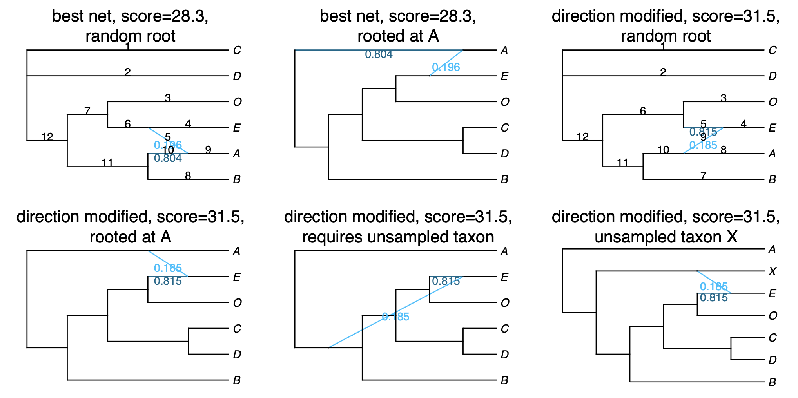
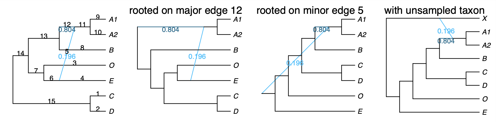

## Running SNaQ

To run SNaQ, you need
- data extracted from sequence alignments:
  - a list of estimated **unrooted** gene trees, or
  - a table of concordance factors (CF) (e.g. from BUCKy)
- a starting topology (e.g. from Quartet MaxCut or ASTRAL, or RAxML tree from a single gene...)

In the `analysis` folder, we have:
- starting topology in `nexus.QMC.tre`
- table of concordance factors in `nexus.CFs.csv`

We move into the `analysis` folder and start a `julia` session:

```
cd analysis
julia
```

Note that we do not need to run this inside the Docker container anymore. We can run this locally as long as Julia is installed.

Loading the Julia packages in Julia:
```julia
using PhyloNetworks
using PhyloPlots
```

### 1. Read the CF table into Julia:
```julia
buckyCF = readTableCF("nexus.CFs.csv")
```

For the commands to read estimated gene trees, see [here](https://crsl4.github.io/PhyloNetworks.jl/latest/man/inputdata/#Tutorial-data:-gene-trees).

### 2. Read the starting population tree into Julia:
```julia
tre = readTopology("nexus.QMC.tre")
```

### 3. Estimate the best network for a number of hybridizations
Estimate the best network from bucky's quartet CF and `hmax` number of hybridizations (make sure to have a folder called `snaq` in the working directory):
```julia
net1 = snaq!(tre, buckyCF, hmax=1, runs=1, filename="net1_snaq", seed=456, ftolRel=1.0e-4, ftolAbs=1.0e-4,liktolAbs = 1.0e-4)
```

We are just doing 1 run (`runs=1`) and we are increasing the optimization tolerance (`ftolRel=1.0e-4, ftolAbs=1.0e-4,liktolAbs = 1.0e-4`) for the sake of computational time, but you should do at least 10 runs in your data and keep the default tolerance parameters.

To use multiple threads while running snaq, see [here](https://crsl4.github.io/PhyloNetworks.jl/latest/man/snaq_plot/#parallel-computations).

**Important:** You should increase the number of hybridizations sequentially:
`hmax=0,1,2,...`, and use the best network at `h-1` as starting
point to estimate the best network at `h`.

### 4. Plot the estimated network

Recall that the produced network is semi-directed, not rooted, so we need to root at the outgroup:
```julia
rootatnode!(net1, "Smi165")
```

If you get an error when trying to root at your outgroup, make sure to check the `.networks` file for alternative networks that could have a similar pseudolik score.

<div style="text-align:center"></div>

Now, we will plot the estimated networks:
```julia
plot(net1, :R);
```

If a plot window didn't pop up, an alternative is to save the plot
as a pdf and open it outside of julia:

```julia
R"pdf"("plot-net1.pdf", width=3, height=3);
plot(net1, :R);
R"dev.off()";
```

**Important:** SNaQ can infer hybridizations with extinct or unsampled taxa (ghost lineages). Thus, keep this in mind when interpreting the hybridization event, especially if the hybridization event appears to be connecting an ancestral lineage with a more recent one.

<div style="text-align:center"></div>

## Bootstrapping

You need as input:

- data from sequence alignment that capture uncertainty:
  - credibility intervals for quartet concordance factors, from TICR
  - bootstrap gene trees from RAxML (same format that ASTRAL uses)
- a starting topology

### 1. Reading in data

We will focus on the case of CF credibility intervals:

```julia
using CSV, DataFrames
buckyDat = CSV.read("nexus.CFs.csv") # names like: CF12_34, CF12_34_lo etc.
```

[we want to do this in parallel]

### 2. Running bootstrap
```julia
bootnet = bootsnaq(tre, buckyDat, hmax=1, nrep=10, runs=1,
                   filename="bootsnaq1", ftolRel=1.0e-4, ftolAbs=1.0e-4,liktolAbs = 1.0e-4)
```

Again, these settings are to make calculations faster. For a real data set,
up the number of bootstrap replicates to 100 or more, by changing `nrep`.
Also increase the number of independent search runs per replicate, `runs`
or just remove the `runs` option to get the default 10 runs.


### 3. Bootstrap summary

If you close your session after having generated these bootstrap networks, you can
read them from the output file later, in a new session.
This output file ends in `.out`, so you would do this:
```julia
bootnet = readMultiTopology("bootsnaq1.out");
```

To make summaries, it's best to re-read the reference network (best,
estimated network) from file, to get a consistent numbering of nodes and edges.
Here, we re-read from file, re-root the network correctly.

```julia
net1 = readTopology("net1_snaq.out")
rootatnode!(net1, "Smi165")
```


#### 7.3.1 Bootstrap summary of tree edges

Same as with species tree, we simply count the number of times each edge in the major tree from the estimated network appears in the bootstrap major trees.

```julia
BSe_tree, tree1 = treeEdgesBootstrap(bootnet,net1)
show(BSe_tree, allrows=true)
BSe_tree[BSe_tree[:proportion] .< 1.0, :]
```
where `tree1` is the major tree in `net1` (the best network estimated with the original data)
and `BSe_tree` is a data frame with the bootstrap support that each tree edge is found
in the major tree.

[add output here to interpret]

We can plot this information on the estimated network.
The command will only label the edges with
bootstrap support less than 100%.

```julia
plot(net1,  :R, edgeLabel=BSe_tree[BSe_tree[:proportion] .< 100.0, :]);
```

#### 7.3.2 Bootstrap summary of hybridization events

We focus on three types of clades:
- hybrid clade: hardwired cluster (descendants) of either hybrid edge
- major sister clade: hardwired cluster of the sibling edge of the major hybrid edge
- minor sister clade: hardwired cluster of the sibling edge of the minor hybrid edge

<br>

```julia
BSn, BSe, BSc, BSgam, BSedgenum = hybridBootstrapSupport(bootnet, net1);
```
- `BSn` is a table of bootstrap frequencies associated with **n**odes
- `BSe` is a table of bootstrap frequencies associated with **e**dges, and
- `BSc` describes the makeup of all **c**lades.

[wait to run actual analysis to interpret]