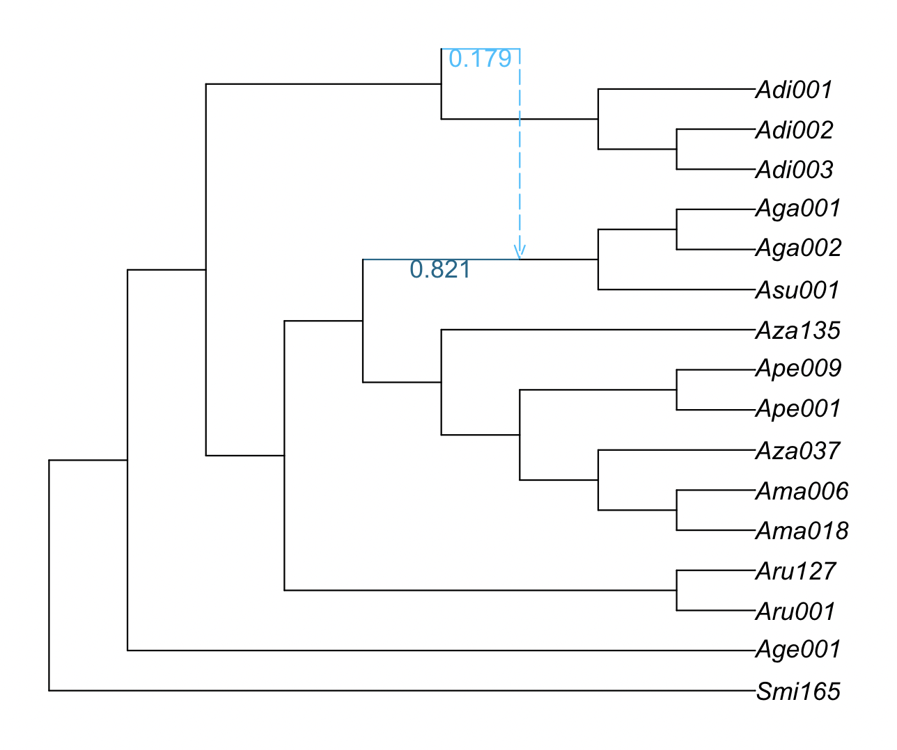
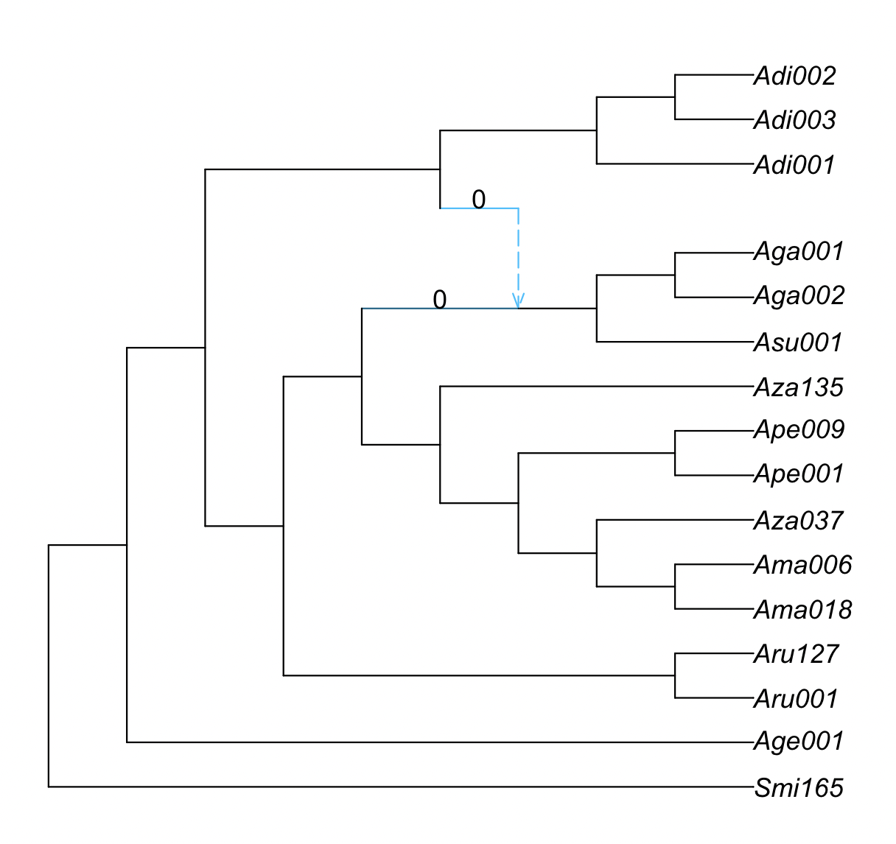
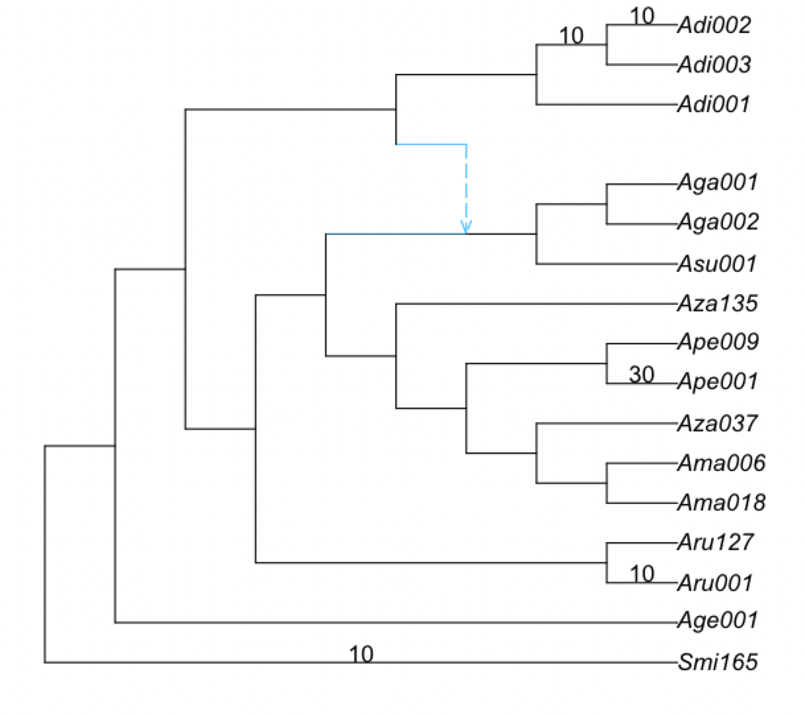

# Estimating phylogenetic networks with SNaQ

To run SNaQ, you need
- data extracted from sequence alignments:
  - a list of estimated unrooted gene trees, or
  - a table of concordance factors (CF) (e.g. from BUCKy)
- a starting topology (e.g. from Quartet MaxCut or ASTRAL, or RAxML tree from a single gene...)

In the `analysis` folder, we have:
- starting topology in `nexus.QMC.tre`
- table of concordance factors in `nexus.CFs.csv`

We move into the `analysis` folder and start a `julia` session:

```
cd analysis
julia
```

Note that we do not need to run this inside the Docker container anymore. We can run this locally as long as Julia is installed.

Loading the Julia packages in Julia:
```julia
using PhyloNetworks
using SNaQ
using PhyloPlots
```

### 1. Read the CF table into Julia:
```julia
buckyCF = readtableCF("nexus.CFs.csv")
```

For the commands to read estimated gene trees, see [here](https://juliaphylo.github.io/SNaQ.jl/stable/man/snaq_est/#CFs-from-gene-trees).

### 2. Read the starting population tree into Julia:
```julia
tre = readnewick("nexus.QMC.tre")
```

### 3. Estimate the best network for a number of hybridizations

Estimate the best network from BUCKy's quartet CF and `hmax` number of hybridizations:
```julia
net1 = snaq!(tre, buckyCF, hmax=1, runs=1, filename="net1_snaq", seed=456, ftolRel=1.0e-4, ftolAbs=1.0e-4,liktolAbs = 1.0e-4)
```

The options we are using are:
- `hmax=1`: maximum one hybridization event
- `runs=1`: number of runs for the optimization; set to 1 to make the run fast, but you want to do at least `runs=10` (which is the default) for your real analysis
- `filename="net1_snaq"`: rootname for the output files (described below)
- `seed=456`: random seed to replicate the analysis
- `ftolRel=1.0e-4, ftolAbs=1.0e-4,liktolAbs = 1.0e-4`: optimization tolerance values chosen so that the run is fast. For your analyses, you do not need to specify these quantities and can simply use the defaults 


The following output is printed to the screen:
```
optimization of topology, BL and inheritance probabilities in SNaQ.jl using:
 hmax = 1,
 tolerance parameters: ftolRel=0.0001, ftolAbs=0.0001,
                       xtolAbs=0.001, xtolRel=0.01.
 max number of failed proposals = 75, liktolAbs = 0.0001.
rootname for files: net1_snaq
BEGIN: 1 runs on starting tree (Adi003,Adi002,(Adi001,((Smi165,Age001):0.11282763783172885,((Aru001,Aru127):1.8895892722315206,(((((Ama018,Ama006):0.635979116918197,Aza037):0.2064967739309278,(Ape001,Ape009):0.7567729870351637):0.17709162771363504,Aza135):1.3242277867359862,((Aga002,Aga001):1.1662225201998988,Asu001):1.33643060185584):0.10642736789559729):0.45657761568828575):2.424105745425032):0.1638513742450063);
2025-05-20 15:51:6.718
seed: 456 for run 1, 2025-05-20 15:51:8.268
best network and networks with different hybrid/gene flow directions printed to .networks file

MaxNet is ((Adi001,(((Smi165,Age001):0.10909139515055954,((Aru001,Aru127):1.783553809432207,(((((Ama018,Ama006):0.6686980253651718,Aza037):0.19099507776876928,(Ape001,Ape009):0.754921262227867):0.15053133922303902,Aza135):1.1427622517130929,((Asu001,(Aga002,Aga001):0.9081531659227717):0.48236561520817717)#H17:2.0594381934607306::0.8210853726908922):0.18471450412843127):0.5158573560102714):0.22659449745358853,#H17:0.697544251960922::0.17891462730910784):2.1586763301439107):0.1426954054706382,Adi003,Adi002); 
with -loglik 815.1786591571492
HybridNetwork, Semidirected Network
32 edges
32 nodes: 16 tips, 1 hybrid nodes, 15 internal tree nodes.
tip labels: Adi003, Adi002, Adi001, Smi165, ...
((Adi001,(((Smi165,Age001):0.109,((Aru001,Aru127):1.784,(((((Ama018,Ama006):0.669,Aza037):0.191,(Ape001,Ape009):0.755):0.151,Aza135):1.143,((Asu001,(Aga002,Aga001):0.908):0.482)#H17:2.059::0.821):0.185):0.516):0.227,#H17:0.698::0.179):2.159):0.143,Adi003,Adi002);
```

To use multiple threads while running SNaQ, see [here](https://juliaphylo.github.io/SNaQ.jl/stable/man/parallelcomputation/).

{: .important }
You should increase the number of hybridizations sequentially:
`hmax=0,1,2,...`, and use the best network at `h-1` as starting
point to estimate the best network at `h`.

### 4. Overview of the output files

The estimated network is in the `net1_snaq.out` file which also has the running time: 2082.5 seconds (~35 minutes) in my computer:

```
% less analysis/net1_snaq.out 

((Adi001,(((Smi165,Age001):0.10909139515055954,((Aru001,Aru127):1.783553809432207,(((((Ama018,Ama006):0.6686980253651718,Aza037):0.19099507776876928,(Ape001,Ape009):0.754921262227867):0.15053133922303902,Aza135):1.1427622517130929,((Asu001,(Aga002,Aga001):0.9081531659227717):0.48236561520817717)#H17:2.0594381934607306::0.8210853726908922):0.18471450412843127):0.5158573560102714):0.22659449745358853,#H17:0.697544251960922::0.17891462730910784):2.1586763301439107):0.1426954054706382,Adi003,Adi002); -Ploglik = 815.1786591571492
 Dendroscope: ((Adi001,(((Smi165,Age001):0.10909139515055954,((Aru001,Aru127):1.783553809432207,(((((Ama018,Ama006):0.6686980253651718,Aza037):0.19099507776876928,(Ape001,Ape009):0.754921262227867):0.15053133922303902,Aza135):1.1427622517130929,((Asu001,(Aga002,Aga001):0.9081531659227717):0.48236561520817717)#H17:2.0594381934607306):0.18471450412843127):0.5158573560102714):0.22659449745358853,#H17:0.697544251960922):2.1586763301439107):0.1426954054706382,Adi003,Adi002);
 Elapsed time: 2082.5 seconds, 1 attempted runs
-------
List of estimated networks for all runs (sorted by log-pseudolik; the smaller, the better):
 ((Adi001,(((Smi165,Age001):0.10909139515055954,((Aru001,Aru127):1.783553809432207,(((((Ama018,Ama006):0.6686980253651718,Aza037):0.19099507776876928,(Ape001,Ape009):0.754921262227867):0.15053133922303902,Aza135):1.1427622517130929,((Asu001,(Aga002,Aga001):0.9081531659227717):0.48236561520817717)#H17:2.0594381934607306::0.8210853726908922):0.18471450412843127):0.5158573560102714):0.22659449745358853,#H17:0.697544251960922::0.17891462730910784):2.1586763301439107):0.1426954054706382,Adi003,Adi002);, with -loglik 815.1786591571492
-------
```

The `net1_snaq.networks` file contains multiple candidate networks that are obtained by rotating the position of the hybrid node in the hybridization cycle. For example, the figure below shows a hybridization cycle with 4 nodes and two positions for the hybrid node.

<div style="text-align:center"></div>

This `.networks` file exists so that you can check if a different placement of the hybrid node in the cycle makes more sense biologically, or when you cannot root your network on your outgroup because of the position of the hybrid node. Make sure to check the pseudolikelihood score of the candidate networks so that you select one that has comparable pseudolik score to the best network (see an example below).

The files `net1_snaq.log` and `net1_snaq.err` contain information about the runs and possible errors, and are only useful if you get an error from SNaQ and want to report it as a [GitHub issue](https://github.com/JuliaPhylo/SNaQ.jl/issues).

### 4. Plot the estimated network

Recall that the produced network is semi-directed, not rooted, so we need to root at the outgroup:
```julia
rootatnode!(net1, "Smi165")
```

If you get an error when trying to root at your outgroup, make sure to check the `.networks` file for alternative networks that could have a similar pseudolik score.

<div style="text-align:center"></div>

Now, we will plot the estimated networks:
```julia
plot(net1, showgamma=true);
```

<div style="text-align:center"></div>

If a plot window didn't pop up, an alternative is to save the plot
as a pdf and open it outside of julia:

```julia
R"pdf"("plot-net1.pdf", width=3, height=3);
plot(net1, :R);
R"dev.off()";
```

{: .important }
SNaQ can infer hybridizations with extinct or unsampled taxa (ghost lineages). Thus, keep this in mind when interpreting the hybridization event, especially if the hybridization event appears to be connecting an ancestral lineage with a more recent one.

<div style="text-align:center"></div>

# Bootstrapping

You need as input:

- data from sequence alignment that capture uncertainty:
  - credibility intervals for quartet concordance factors, from TICR
  - bootstrap gene trees from RAxML (same format that ASTRAL uses)
- a starting topology

## 1. Reading in data

We will focus on the case of CF credibility intervals:

```julia
using CSV, DataFrames
buckyDat = CSV.read("nexus.CFs.csv", DataFrame) # names like: CF12_34, CF12_34_lo etc.
```

In this case, the column names are not `CF12_34`, but `CF12.34`, so we need to change the column names:

```julia
buckyDat2 = rename(buckyDat, ["taxon1", "taxon2", "taxon3", "taxon4", 
 "CF12_34", 
 "CF12_34_lo",
 "CF12_34_hi",
 "CF13_24",
 "CF13_24_lo",
 "CF13_24_hi",
 "CF14_23",
 "CF14_23_lo",
 "CF14_23_hi",
 "ngenes"]) # rename columns
```

## 2. Running bootstrap
```julia
bootnet = bootsnaq(tre, buckyDat2, hmax=1, nrep=10, runs=1,
                   filename="bootsnaq1", ftolRel=1.0e-4, ftolAbs=1.0e-4,liktolAbs = 1.0e-4)
```

The options we are using are:
- `hmax=1`: maximum one hybridization event
- `nrep=10`: number of bootstrap replicates; you want to do at least 30 for your real analysis
- `runs=1`: number of runs for the optimization; set to 1 to make the run fast, but you want to do at least `runs=10` (which is the default) for your real analysis
- `filename="bootsnaq1"`: rootname for the output files
- `seed=456`: random seed to replicate the analysis
- `ftolRel=1.0e-4, ftolAbs=1.0e-4,liktolAbs = 1.0e-4`: optimization tolerances chosen so that the run is fast. For your analyses, you do not need to specify these quantities and simply use the defaults 


## 3. Bootstrap summary

If you close your session after having generated these bootstrap networks, you can
read them from the output file later, in a new session.
This output file ends in `.out`, so you would do this:
```julia
bootnet = readmultinewick("bootsnaq1.out");
```

To make summaries, it's best to re-read the reference network (best,
estimated network) from file, to get a consistent numbering of nodes and edges.
Here, we re-read from file, re-root the network correctly.

```julia
net1 = readnewick("net1_snaq.out")
rootatnode!(net1, "Smi165")
```


### 3.1 Bootstrap summary of tree edges

Similarly to how we compute bootstrap support on species trees, we simply count the number of times each edge in the major tree from the estimated network appears in the bootstrap major trees.

```julia
BSe_tree, tree1 = treeedges_support(bootnet,net1)
```
where `tree1` is the major tree in `net1` (the best network estimated with the original data)
and `BSe_tree` is a data frame with the bootstrap support that each tree edge is found
in the major tree.

```julia
julia> show(BSe_tree, allrows=true)
13×2 DataFrame
 Row │ edgeNumber  proportion 
     │ Int64       Float64    
─────┼────────────────────────
   1 │          4       100.0
   2 │         26       100.0
   3 │          7       100.0
   4 │         25       100.0
   5 │         18       100.0
   6 │         16       100.0
   7 │         12       100.0
   8 │         10       100.0
   9 │         15       100.0
  10 │         23       100.0
  11 │         22       100.0
  12 │         27       100.0
  13 │         30       100.0
```

In this case, all the tree edges have 100% bootstrap support. The following command would allow us to list the edges that do not have 100% bootstrap support (in this case, this data frame is empty):

```julia
julia> BSe_tree[BSe_tree[!,:proportion] .< 100.0, :]
0×2 DataFrame
```

We can plot this information on the estimated network.
The command will only label the edges with
bootstrap support less than 100%.

```julia
plot(net1, edgelabel=BSe_tree[BSe_tree[!,:proportion] .< 100.0, :]);
```

In this case, the plot is the same as before because all edges have 100% bootstrap support,
so we do not show it.

### 3.2 Bootstrap summary of hybridization events

Summarizing bootstrap support on hybridization events is not straightforward because
different edges could correspond to the same split in taxa.

To summarize bootstrap support on networks, we focus on three types of clades:
- hybrid clade: hardwired cluster (descendants) of either hybrid edge
- major sister clade: hardwired cluster of the sibling edge of the major hybrid edge
- minor sister clade: hardwired cluster of the sibling edge of the minor hybrid edge

<br>

The following function computes the proportion of times that different clades 
appear as hybrid, major sister or minor sister in the bootstrap networks:

```julia
BSn, BSe, BSc, BSgam, BSedgenum = hybridclades_support(bootnet, net1);
```
- `BSn` is a table of bootstrap frequencies associated with **n**odes
- `BSe` is a table of bootstrap frequencies associated with **e**dges, and
- `BSc` describes the makeup of all **c**lades.

First, we plot the proportion of times that the major and minor hybrid edges of the best 
network appear in the bootstrap networks:

```julia
plot(net1, edgelabel=BSe[!,[:edge,:BS_hybrid_edge]]);
```

<div style="text-align:center"></div>

In this case, there are 0% of bootstrap networks that have the major hybrid edge and 0% bootstrap networks that have the minor hybrid edge. Recall that we only ran 10 bootstrap replicates with 1 run each, so the runs have likely not converged in this case.

What do the remaining bootstrap networks have?

```julia
julia> BSe
16×8 DataFrame
 Row │ edge     hybrid_clade  hybrid   sister_clade  sister  BS_hybrid_edge  BS_major  BS_minor 
     │ Int64?   String        Int64?   String        Int64?  Float64         Float64   Float64  
─────┼──────────────────────────────────────────────────────────────────────────────────────────
   1 │      24  H17                15  c_minus10        -10             0.0       0.0       0.0
   2 │      28  H17                15  c_minus3          -3             0.0       0.0       0.0
   3 │ missing  Ape001              9  Ape009            10            30.0      30.0       0.0
   4 │ missing  Ape001              9  H17              -16            30.0       0.0      30.0
   5 │ missing  c_34          missing  Aza135            11            20.0      20.0       0.0
   6 │ missing  c_34          missing  Ape001             9            20.0       0.0      20.0
   7 │ missing  Smi165              2  Age001             3            10.0      10.0       0.0
   8 │ missing  Smi165              2  Ama006             7            10.0       0.0      10.0
   9 │ missing  Adi002             17  Adi003            16            10.0      10.0       0.0
  10 │ missing  Adi002             17  Aru001             4            10.0       0.0      10.0
  11 │ missing  c_35          missing  c_minus8          -8            10.0      10.0       0.0
  12 │ missing  c_35          missing  H17              -16            10.0       0.0      10.0
  13 │ missing  c_minus2           -2  Adi001             1            10.0      10.0       0.0
  14 │ missing  c_minus2           -2  Ama018             6            10.0       0.0      10.0
  15 │ missing  Aru001              4  Aru127             5            10.0      10.0       0.0
  16 │ missing  Aru001              4  Age001             3            10.0       0.0      10.0
```

We can understand the meaning of each column with `? hybridclade_support` in julia.
We can see, for example, that in 30% of the bootstrap networks there is a hybrid edge 
from `Ape001` to `Ape009`. Because `BS_major` is also 30, we conclude that this edge appears as the major hybrid edge in 30% of the bootstrap networks. We note that this edge does not appear in the estimated network (`net1`) since the column `edge` is `missing`.

Sometimes, there is not a taxon name, but a clade, like `c_minus8`. The information of which clade this represents can be found in the `BSc` data frame:

```julia
julia> BSc
16×18 DataFrame
 Row │ taxa    Adi001  Smi165  Age001  Aru001  Aru127  c_minus8  Ama018  Ama006  Ape001  Ape009  Aza135  H17    c ⋯
     │ String  Bool    Bool    Bool    Bool    Bool    Bool      Bool    Bool    Bool    Bool    Bool    Bool   B ⋯
─────┼─────────────────────────────────────────────────────────────────────────────────────────────────────────────
   1 │ Adi001    true   false   false   false   false     false   false   false   false   false   false  false    ⋯
   2 │ Smi165   false    true   false   false   false     false   false   false   false   false   false  false
   3 │ Age001   false   false    true   false   false     false   false   false   false   false   false  false
   4 │ Aru001   false   false   false    true   false      true   false   false   false   false   false  false
   5 │ Aru127   false   false   false   false    true      true   false   false   false   false   false  false    ⋯
   6 │ Ama018   false   false   false   false   false     false    true   false   false   false   false  false
   7 │ Ama006   false   false   false   false   false     false   false    true   false   false   false  false
   8 │ Aza037   false   false   false   false   false     false   false   false   false   false   false  false
   9 │ Ape001   false   false   false   false   false     false   false   false    true   false   false  false    ⋯
  10 │ Ape009   false   false   false   false   false     false   false   false   false    true   false  false
  11 │ Aza135   false   false   false   false   false     false   false   false   false   false    true  false
  12 │ Asu001   false   false   false   false   false     false   false   false   false   false   false   true
  13 │ Aga002   false   false   false   false   false     false   false   false   false   false   false   true    ⋯
  14 │ Aga001   false   false   false   false   false     false   false   false   false   false   false   true
  15 │ Adi003   false   false   false   false   false     false   false   false   false   false   false  false
  16 │ Adi002   false   false   false   false   false     false   false   false   false   false   false  false
```

Or specifically:

```
julia> BSc[!,:taxa][BSc[!,:c_minus8]]
2-element Vector{String}:
 "Aru001"
 "Aru127"
```

We can look at the estimated network again to find this clade:

<div style="text-align:center"></div>

and the hybrid clade is:

```julia
julia> BSc[!,:taxa][BSc[!,:H17]]
3-element Vector{String}:
 "Asu001"
 "Aga002"
 "Aga001"
```

We can also quantity the proportion of the times that the same hybridization event (same hybrid node with same major and minor hybrid edges) appear in the bootstrap networks.

```julia
plot(net1, nodelabel=BSn[!,[:hybridnode,:BS_hybrid_samesisters]]);
```
which in this case (because we did not do enough replicates or enough number of runs) is zero:

<div style="text-align:center"></div>

We can also plot the bootstrap support for hybrid clades, regardless of their sisters. Here, it is shown on the parent edge of each node with positive hybrid support:

```julia
plot(net1, edgelabel=BSn[BSn[!,:BS_hybrid].>0, [:edge,:BS_hybrid]]);
```

<div style="text-align:center"></div>

