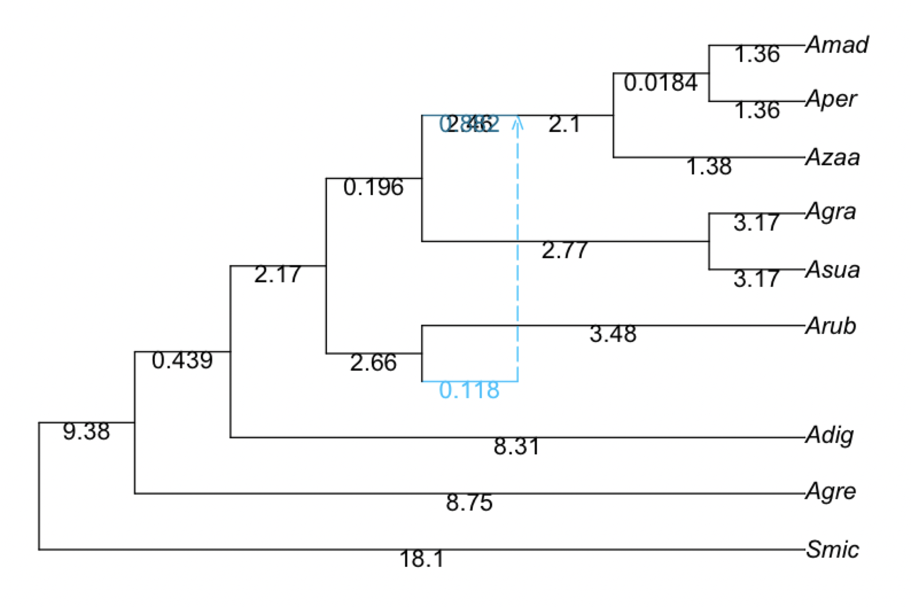
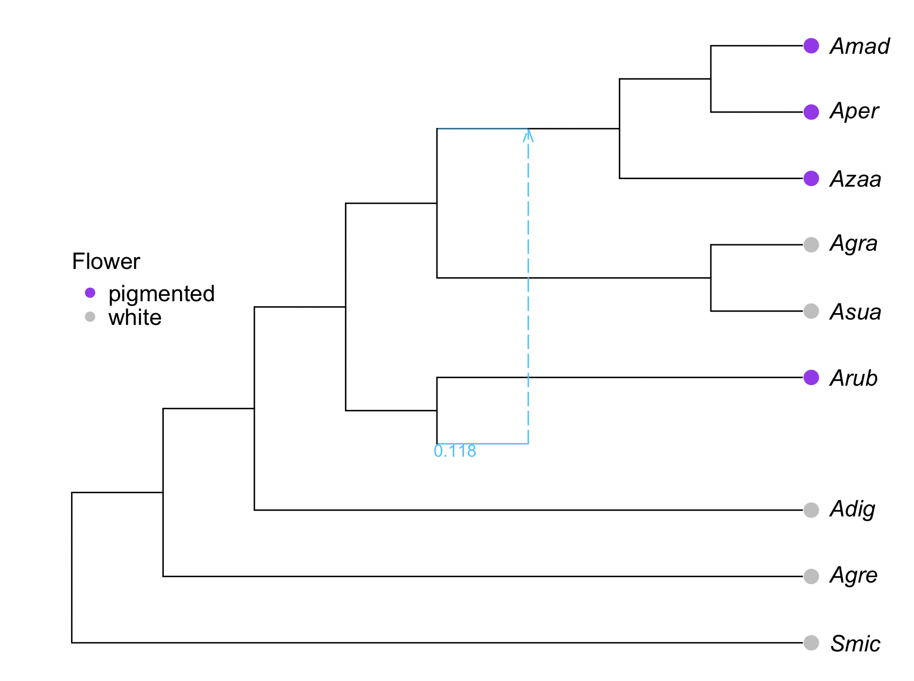
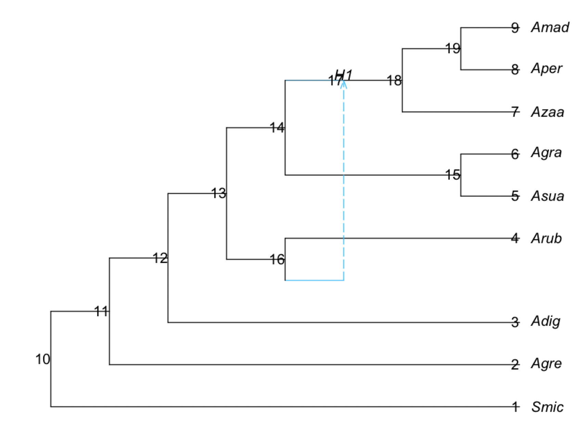

# Trait evolution on phylogenetic networks

We assume a fixed network, correctly rooted, with branch lengths proportional to calendar time. Note that SNaQ will estimate branches in coalescent units, and we need to calibrate the network so that branches are proportional to calendar time. We will skip this step here and provide the calibrated network, but you can do this calibration with what you learned in the workshop about BPP.

We want to be inside the `analysis` folder.

```julia
net1 = readTopology("(Smic:18.12505298,(Agre:8.747492442,(Adig:8.308140028,((#H1:0.0::0.117935,Arub:3.476676179):2.658717826,((Asua:3.171531094,Agra:3.171531094):2.767496398,((Azaa:1.381629136,(Aper:1.363263922,Amad:1.363263922):0.01836521346):2.095047043)#H1:2.460938604::0.882065):0.1963665132):2.172746023):0.4393524143):9.377560535);")
rootatnode!(net1, "Smic")

plot(net1, :R, showGamma=true, showEdgeLength=true)
```

<div style="text-align:center"></div>


Now, we want to read the trait data (denoted `traitData.txt` in the [`data` folder](https://github.com/solislemuslab/snaq-tutorial/tree/main/data)).

In the shell:
```
$ less ../data/traitData.txt

Species Short_Name      Flower_Color    Pollination_Syndrom
A_digitata      Adig    white   mammal
A_suarezensis   Asua    white   mammal
A_grandidieri   Agra    white   mammal
A_za    Azaa    pigmented       hawkmoth
A_madagascariensis      Amad    pigmented       hawkmoth
A_perrieri      Aper    pigmented       hawkmoth
A_rubrostipa    Arub    pigmented       hawkmoth
A_gregorii      Agre    white   hawkmoth
S_micrantha Smic        white   both
```

In julia:

```julia
using CSV, DataFrames

df = CSV.read("../data/traitData.txt", DataFrame, stringtype=String)
```

First, we will try to plot the traits. We need to remove the species columns from the data:

```julia
species = df.Short_Name # or: dat[!, :species]
select!(df, Not(:Short_Name)) # select all columns except for :Short_Name; modifies dat in place
select!(df, Not(:Species)) 
select!(df, Not(:Pollination_Syndrom)) 
```

```julia
using RCall, PhyloPlots
R"par"(mar=[0,0,0,0]); # to reduce margins
res = plot(net1, tipoffset=0.3); # the results "res" provides point coordinates, to use for data annotation
o = [findfirst(isequal(tax), species) for tax in tipLabels(net1)] # 5,2,4,1,3,6: order to match taxa from "species" to tip labels
isequal(species[o], tipLabels(net1)) # true :)
traitcolor = map(x -> (x=="white" ? "grey" : "purple"), df.Flower_Color[o])
leaves = res[13][!,:lea]
R"points"(x=res[13][leaves,:x] .+0.1, y=res[13][leaves,:y], pch=16, col=traitcolor, cex=1.5); # adds grey & red points
R"legend"(x=1, y=7, legend=["pigmented","white"], pch=16, col=["purple","grey"],
          title="Flower", bty="n",var"title.adj"=0);
# next: add to gene flow edge the proportion γ of genes affected
hi = findfirst([!e.isMajor for e in net1.edge]) # 6 : "h"ybrid "i"ndex: index of gene flow edge (minor hybrid) in net: horizontal segment
R"text"(res[14][hi,:x]-0.3, res[14][hi,:y]-0.1, res[14][hi,:gam], col="deepskyblue", cex=0.75); # add the γ value
```

<div style="text-align:center"></div>


## Inference of evolutionary rates 

Choose a model to describe how evolutionary changes happened over time.
For general trait types, use one of these three Markov substitution models:

- `:BTSM` Binary Trait Substitution Model (2 states, rates unconstrained)
- `:ERSM` Equal Rates Substitution Model (k states, all transitions possible with equal rates)
- `:TBTSM` Two Binary Trait Substitution Model (though not fully implemented yet)

To infer evolutionary rates, run `fitdiscrete` on the network and data. It will calculate the maximum likelihood score of one or more discrete trait characters at the tips on a fixed network with the following assumptions:

- Along each edge, evolutionary changes are modeled with a continous time Markov model.
- At a hybrid node, the trait is assumed to be inherited from one or the other of its parents (immediately before the reticulation event), with probabilities equal to the inheritance γ of each parent edge, which is given by the network.
- At the root of the network, a uniform distribution among the possible states is assumed a priori.
- The model ignores incomplete lineage sorting (e.g. hemiplasy).

```julia
s1 = fitdiscrete(net1, :ERSM, species, df; optimizeQ=false)
```
where the arguments are:
- `net1` is the estimated (calibrated) network
- `:ERSM` is the substitution model
- `species` is an array with the species names at the tips
- `df` is the dataframe that has the trait (Flower color in this case)
- `optimizeQ=false` means that the transition rates will stay at their starting values, without being optimized.

```
PhyloNetworks.StatisticalSubstitutionModel:
Equal Rates Substitution Model with k=2,
  all rates equal to α=0.01403.
  rate matrix Q:
             white pigmented
     white       *  0.0140
  pigmented  0.0140       *
on a network with 1 reticulations
data:
  9 species
  1 trait
log-likelihood: -6.10081
```

## Ancestral state reconstruction

The command to reconstruct the ancestral states is:
```julia
ancestralStateReconstruction(s1)
```

which provides the following output:

```julia
julia> ancestralStateReconstruction(s1)
19×4 DataFrame
 Row │ nodenumber  nodelabel  white       pigmented  
     │ Int64       String     Float64     Float64    
─────┼───────────────────────────────────────────────
   1 │          1  Smic       1.0         0.0
   2 │          2  Agre       1.0         0.0
   3 │          3  Adig       1.0         0.0
   4 │          4  Arub       0.0         1.0
   5 │          5  Asua       1.0         0.0
   6 │          6  Agra       1.0         0.0
   7 │          7  Azaa       0.0         1.0
   8 │          8  Aper       0.0         1.0
   9 │          9  Amad       0.0         1.0
  10 │         10  10         0.956058    0.0439417
  11 │         11  11         0.980099    0.0199013
  12 │         12  12         0.977674    0.0223259
  13 │         13  13         0.86375     0.13625
  14 │         14  14         0.864546    0.135454
  15 │         15  15         0.993368    0.00663154
  16 │         16  16         0.264048    0.735952
  17 │         17  H1         0.217158    0.782842
  18 │         18  18         8.94943e-5  0.999911
  19 │         19  19         5.25928e-5  0.999947
```

The `white` and `pigmented` columns correspond to the probability that the state in a given node correspond to each of these trait values. The rows correspond to different nodes, with the internal nodes represented by their node number.

To know to which node each row correspond, we can plot the network with node numbers:

```julia
plot(s1.net, shownodenumber=true, shownodelabel=true, tipoffset=0.2);
```

<div style="text-align:center"></div>
